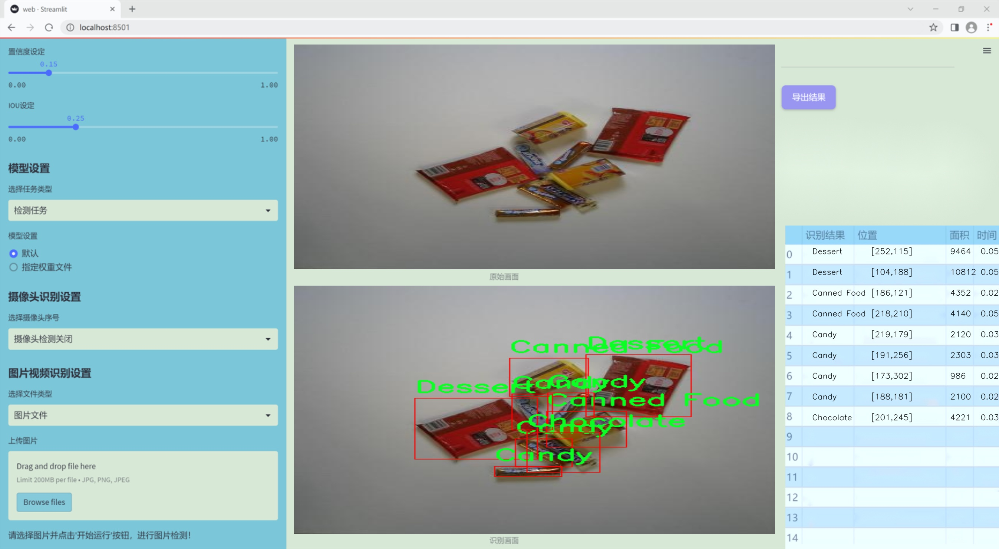
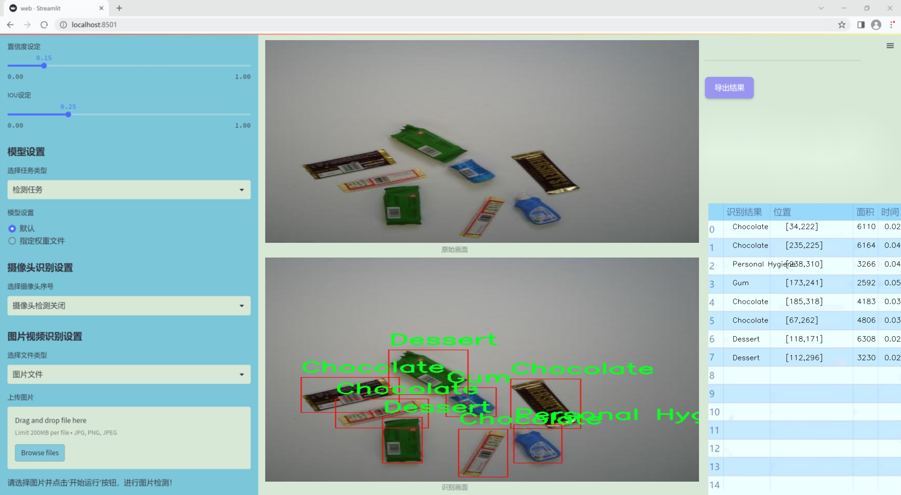
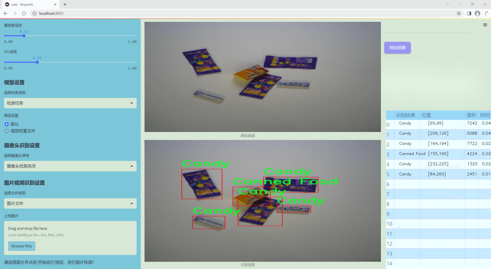
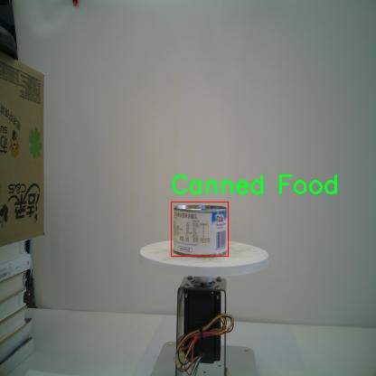
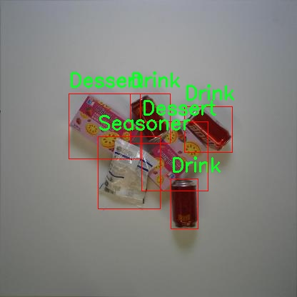
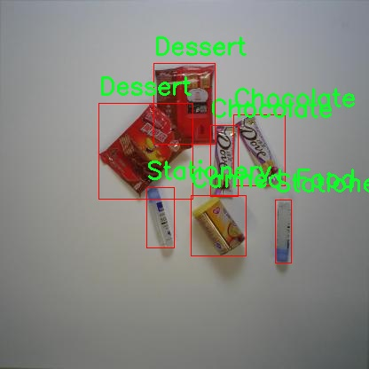
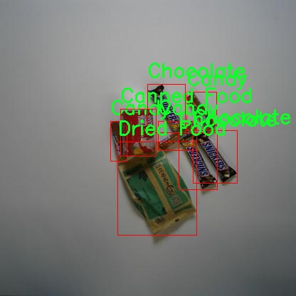
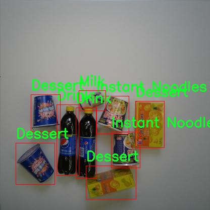

# 改进yolo11-goldyolo等200+全套创新点大全：食品分类检测系统源码＆数据集全套

### 1.图片效果展示







##### 项目来源 **[人工智能促进会 2024.10.30](https://kdocs.cn/l/cszuIiCKVNis)**

注意：由于项目一直在更新迭代，上面“1.图片效果展示”和“2.视频效果展示”展示的系统图片或者视频可能为老版本，新版本在老版本的基础上升级如下：（实际效果以升级的新版本为准）

  （1）适配了YOLOV11的“目标检测”模型和“实例分割”模型，通过加载相应的权重（.pt）文件即可自适应加载模型。

  （2）支持“图片识别”、“视频识别”、“摄像头实时识别”三种识别模式。

  （3）支持“图片识别”、“视频识别”、“摄像头实时识别”三种识别结果保存导出，解决手动导出（容易卡顿出现爆内存）存在的问题，识别完自动保存结果并导出到tempDir中。

  （4）支持Web前端系统中的标题、背景图等自定义修改。

  另外本项目提供训练的数据集和训练教程,暂不提供权重文件（best.pt）,需要您按照教程进行训练后实现图片演示和Web前端界面演示的效果。

### 2.视频效果展示

[2.1 视频效果展示](https://www.bilibili.com/video/BV1QtSjYaEzN/)

### 3.背景

研究背景与意义

随着食品安全问题的日益突出，食品分类与检测技术在保障公众健康、提升食品质量监管效率方面显得尤为重要。传统的食品分类方法往往依赖人工检查，不仅效率低下，而且容易受到人为因素的影响，导致分类结果的不准确性。近年来，深度学习技术的快速发展为食品分类检测提供了新的解决方案。YOLO（You Only Look Once）系列模型因其高效的实时检测能力，已成为计算机视觉领域的热门选择。特别是YOLOv11模型，凭借其更高的精度和更快的处理速度，成为食品分类检测的理想工具。

本研究旨在基于改进的YOLOv11模型，构建一个高效的食品分类检测系统。我们将使用包含84000张图像的Groceries数据集，该数据集涵盖了多种食品类别，包括牛奶、罐头食品、巧克力、糖果、调味品等，共计100个不同的类目。这种丰富的多样性不仅能够提升模型的泛化能力，还能为实际应用提供更为全面的支持。通过对YOLOv11模型的改进，我们期望能够在提高检测精度的同时，缩短处理时间，从而实现实时食品分类检测。

此外，食品分类检测系统的成功应用将为超市、餐饮行业及食品生产企业提供强有力的技术支持，帮助其在库存管理、产品追溯及食品安全监测等方面提升效率。同时，随着智能零售的兴起，基于视觉识别的自动化系统将为消费者提供更为便捷的购物体验。因此，本研究不仅具有重要的学术价值，也具有广泛的应用前景，能够为食品行业的智能化转型提供切实可行的解决方案。

### 4.数据集信息展示

##### 4.1 本项目数据集详细数据（类别数＆类别名）

nc: 17
names: ['Alcohol', 'Candy', 'Canned Food', 'Chocolate', 'Dessert', 'Dried Food', 'Dried Fruit', 'Drink', 'Gum', 'Instant Drink', 'Instant Noodles', 'Milk', 'Personal Hygiene', 'Puffed Food', 'Seasoner', 'Stationery', 'Tissue']


该项目为【目标检测】数据集，请在【训练教程和Web端加载模型教程（第三步）】这一步的时候按照【目标检测】部分的教程来训练

##### 4.2 本项目数据集信息介绍

本项目数据集信息介绍

本项目所使用的数据集名为“Groceries”，旨在为改进YOLOv11的食品分类检测系统提供丰富的训练素材。该数据集包含17个不同的食品类别，涵盖了广泛的日常消费品，以确保模型在实际应用中的准确性和鲁棒性。具体类别包括：酒精类（Alcohol）、糖果（Candy）、罐装食品（Canned Food）、巧克力（Chocolate）、甜点（Dessert）、干货（Dried Food）、干果（Dried Fruit）、饮料（Drink）、口香糖（Gum）、即饮饮料（Instant Drink）、方便面（Instant Noodles）、牛奶（Milk）、个人卫生用品（Personal Hygiene）、膨化食品（Puffed Food）、调味品（Seasoner）、文具（Stationery）以及纸巾（Tissue）。

“Groceries”数据集的多样性不仅反映了消费者日常生活中的常见食品，还为模型提供了丰富的视觉特征，以便更好地进行分类和检测。每个类别都包含了多种样本，涵盖了不同品牌、包装和外观，确保模型能够学习到更为全面的特征表示。此外，数据集中的图像经过精心标注，确保每个样本的准确性和一致性，这对于训练高效的深度学习模型至关重要。

通过使用“Groceries”数据集，项目旨在提升YOLOv11在食品分类任务中的性能，使其能够在复杂的环境中快速、准确地识别和分类各种食品。这一改进不仅能够增强模型的实用性，还能为零售、物流等行业提供更为智能化的解决方案，推动食品检测技术的进一步发展。整体而言，“Groceries”数据集为本项目的成功实施奠定了坚实的基础。











### 5.全套项目环境部署视频教程（零基础手把手教学）

[5.1 所需软件PyCharm和Anaconda安装教程（第一步）](https://www.bilibili.com/video/BV1BoC1YCEKi/?spm_id_from=333.999.0.0&vd_source=bc9aec86d164b67a7004b996143742dc)


[5.2 安装Python虚拟环境创建和依赖库安装视频教程（第二步）](https://www.bilibili.com/video/BV1ZoC1YCEBw?spm_id_from=333.788.videopod.sections&vd_source=bc9aec86d164b67a7004b996143742dc)

### 6.改进YOLOv11训练教程和Web_UI前端加载模型教程（零基础手把手教学）

[6.1 改进YOLOv11训练教程和Web_UI前端加载模型教程（第三步）](https://www.bilibili.com/video/BV1BoC1YCEhR?spm_id_from=333.788.videopod.sections&vd_source=bc9aec86d164b67a7004b996143742dc)


按照上面的训练视频教程链接加载项目提供的数据集，运行train.py即可开始训练



     Epoch   gpu_mem       box       obj       cls    labels  img_size
     1/200     20.8G   0.01576   0.01955  0.007536        22      1280: 100%|██████████| 849/849 [14:42<00:00,  1.04s/it]
               Class     Images     Labels          P          R     mAP@.5 mAP@.5:.95: 100%|██████████| 213/213 [01:14<00:00,  2.87it/s]
                 all       3395      17314      0.994      0.957      0.0957      0.0843

     Epoch   gpu_mem       box       obj       cls    labels  img_size
     2/200     20.8G   0.01578   0.01923  0.007006        22      1280: 100%|██████████| 849/849 [14:44<00:00,  1.04s/it]
               Class     Images     Labels          P          R     mAP@.5 mAP@.5:.95: 100%|██████████| 213/213 [01:12<00:00,  2.95it/s]
                 all       3395      17314      0.996      0.956      0.0957      0.0845

     Epoch   gpu_mem       box       obj       cls    labels  img_size
     3/200     20.8G   0.01561    0.0191  0.006895        27      1280: 100%|██████████| 849/849 [10:56<00:00,  1.29it/s]
               Class     Images     Labels          P          R     mAP@.5 mAP@.5:.95: 100%|███████   | 187/213 [00:52<00:00,  4.04it/s]
                 all       3395      17314      0.996      0.957      0.0957      0.0845


###### [项目数据集下载链接](https://kdocs.cn/l/cszuIiCKVNis)

### 7.原始YOLOv11算法讲解

##### YOLO11简介

> YOLO11源码地址：https://github.com/ultralytics/ultralytics

Ultralytics
YOLO11是一款尖端的、最先进的模型，它在之前YOLO版本成功的基础上进行了构建，并引入了新功能和改进，以进一步提升性能和灵活性。YOLO11设计快速、准确且易于使用，使其成为各种物体检测和跟踪、实例分割、图像分类以及姿态估计任务的绝佳选择。  


**YOLO11创新点如下:**

YOLO 11主要改进包括：  
`增强的特征提取`：YOLO 11采用了改进的骨干和颈部架构，增强了特征提取功能，以实现更精确的目标检测。  
`优化的效率和速度`：优化的架构设计和优化的训练管道提供更快的处理速度，同时保持准确性和性能之间的平衡。  
`更高的精度，更少的参数`：YOLO11m在COCO数据集上实现了更高的平均精度（mAP），参数比YOLOv8m少22%，使其在不影响精度的情况下提高了计算效率。  
`跨环境的适应性`：YOLO 11可以部署在各种环境中，包括边缘设备、云平台和支持NVIDIA GPU的系统。  
`广泛的支持任务`：YOLO 11支持各种计算机视觉任务，如对象检测、实例分割、图像分类、姿态估计和面向对象检测（OBB）。

**YOLO11不同模型尺寸信息：**

YOLO11 提供5种不同的型号规模模型，以满足不同的应用需求：

Model| size (pixels)| mAPval 50-95| Speed CPU ONNX (ms)| Speed T4 TensorRT10
(ms)| params (M)| FLOPs (B)  
---|---|---|---|---|---|---  
YOLO11n| 640| 39.5| 56.1 ± 0.8| 1.5 ± 0.0| 2.6| 6.5  
YOLO11s| 640| 47.0| 90.0 ± 1.2| 2.5 ± 0.0| 9.4| 21.5  
YOLO11m| 640| 51.5| 183.2 ± 2.0| 4.7 ± 0.1| 20.1| 68.0  
YOLO11l| 640| 53.4| 238.6 ± 1.4| 6.2 ± 0.1| 25.3| 86.9  
YOLO11x| 640| 54.7| 462.8 ± 6.7| 11.3 ± 0.2| 56.9| 194.9  
  
**模型常用训练超参数参数说明：**  
`YOLOv11
模型的训练设置包括训练过程中使用的各种超参数和配置`。这些设置会影响模型的性能、速度和准确性。关键的训练设置包括批量大小、学习率、动量和权重衰减。此外，优化器、损失函数和训练数据集组成的选择也会影响训练过程。对这些设置进行仔细的调整和实验对于优化性能至关重要。  
**以下是一些常用的模型训练参数和说明：**

参数名| 默认值| 说明  
---|---|---  
`model`| `None`| 指定用于训练的模型文件。接受指向 `.pt` 预训练模型或 `.yaml`
配置文件。对于定义模型结构或初始化权重至关重要。  
`data`| `None`| 数据集配置文件的路径（例如
`coco8.yaml`).该文件包含特定于数据集的参数，包括训练数据和验证数据的路径、类名和类数。  
`epochs`| `100`| 训练总轮数。每个epoch代表对整个数据集进行一次完整的训练。调整该值会影响训练时间和模型性能。  
`patience`| `100`| 在验证指标没有改善的情况下，提前停止训练所需的epoch数。当性能趋于平稳时停止训练，有助于防止过度拟合。  
`batch`| `16`| 批量大小，有三种模式:设置为整数(例如，’ Batch =16 ‘)， 60% GPU内存利用率的自动模式(’ Batch
=-1 ‘)，或指定利用率分数的自动模式(’ Batch =0.70 ')。  
`imgsz`| `640`| 用于训练的目标图像尺寸。所有图像在输入模型前都会被调整到这一尺寸。影响模型精度和计算复杂度。  
`device`| `None`| 指定用于训练的计算设备：单个 GPU (`device=0`）、多个 GPU (`device=0,1`)、CPU
(`device=cpu`)，或苹果芯片的 MPS (`device=mps`).  
`workers`| `8`| 加载数据的工作线程数（每 `RANK` 多 GPU 训练）。影响数据预处理和输入模型的速度，尤其适用于多 GPU 设置。  
`name`| `None`| 训练运行的名称。用于在项目文件夹内创建一个子目录，用于存储训练日志和输出结果。  
`pretrained`| `True`| 决定是否从预处理模型开始训练。可以是布尔值，也可以是加载权重的特定模型的字符串路径。提高训练效率和模型性能。  
`optimizer`| `'auto'`| 为训练模型选择优化器。选项包括 `SGD`, `Adam`, `AdamW`, `NAdam`,
`RAdam`, `RMSProp` 等，或 `auto` 用于根据模型配置进行自动选择。影响收敛速度和稳定性  
`lr0`| `0.01`| 初始学习率（即 `SGD=1E-2`, `Adam=1E-3`) .调整这个值对优化过程至关重要，会影响模型权重的更新速度。  
`lrf`| `0.01`| 最终学习率占初始学习率的百分比 = (`lr0 * lrf`)，与调度程序结合使用，随着时间的推移调整学习率。  


**各损失函数作用说明：**  
`定位损失box_loss`：预测框与标定框之间的误差（GIoU），越小定位得越准；  
`分类损失cls_loss`：计算锚框与对应的标定分类是否正确，越小分类得越准；  
`动态特征损失（dfl_loss）`：DFLLoss是一种用于回归预测框与目标框之间距离的损失函数。在计算损失时，目标框需要缩放到特征图尺度，即除以相应的stride，并与预测的边界框计算Ciou
Loss，同时与预测的anchors中心点到各边的距离计算回归DFLLoss。  


### 8.200+种全套改进YOLOV11创新点原理讲解

#### 8.1 200+种全套改进YOLOV11创新点原理讲解大全

由于篇幅限制，每个创新点的具体原理讲解就不全部展开，具体见下列网址中的改进模块对应项目的技术原理博客网址【Blog】（创新点均为模块化搭建，原理适配YOLOv5~YOLOv11等各种版本）

[改进模块技术原理博客【Blog】网址链接](https://gitee.com/qunmasj/good)


#### 8.2 精选部分改进YOLOV11创新点原理讲解

###### 这里节选部分改进创新点展开原理讲解(完整的改进原理见上图和[改进模块技术原理博客链接](https://gitee.com/qunmasj/good)【如果此小节的图加载失败可以通过CSDN或者Github搜索该博客的标题访问原始博客，原始博客图片显示正常】

### Gold-YOLO简介
YOLO再升级：华为诺亚提出Gold-YOLO，聚集-分发机制打造新SOTA
在过去的几年中，YOLO系列模型已经成为实时目标检测领域的领先方法。许多研究通过修改架构、增加数据和设计新的损失函数，将基线推向了更高的水平。然而以前的模型仍然存在信息融合问题，尽管特征金字塔网络（FPN）和路径聚合网络（PANet）已经在一定程度上缓解了这个问题。因此，本研究提出了一种先进的聚集和分发机制（GD机制），该机制通过卷积和自注意力操作实现。这种新设计的模型被称为Gold-YOLO，它提升了多尺度特征融合能力，在所有模型尺度上实现了延迟和准确性的理想平衡。此外，本文首次在YOLO系列中实现了MAE风格的预训练，使得YOLO系列模型能够从无监督预训练中受益。Gold-YOLO-N在COCO val2017数据集上实现了出色的39.9% AP，并在T4 GPU上实现了1030 FPS，超过了之前的SOTA模型YOLOv6-3.0-N，其FPS相似，但性能提升了2.4%。


#### Gold-YOLO


YOLO系列的中间层结构采用了传统的FPN结构，其中包含多个分支用于多尺度特征融合。然而，它只充分融合来自相邻级别的特征，对于其他层次的信息只能间接地进行“递归”获取。

传统的FPN结构在信息传输过程中存在丢失大量信息的问题。这是因为层之间的信息交互仅限于中间层选择的信息，未被选择的信息在传输过程中被丢弃。这种情况导致某个Level的信息只能充分辅助相邻层，而对其他全局层的帮助较弱。因此，整体上信息融合的有效性可能受到限制。
为了避免在传输过程中丢失信息，本文采用了一种新颖的“聚集和分发”机制（GD），放弃了原始的递归方法。该机制使用一个统一的模块来收集和融合所有Level的信息，并将其分发到不同的Level。通过这种方式，作者不仅避免了传统FPN结构固有的信息丢失问题，还增强了中间层的部分信息融合能力，而且并没有显著增加延迟。


# 8.低阶聚合和分发分支 Low-stage gather-and-distribute branch
从主干网络中选择输出的B2、B3、B4、B5特征进行融合，以获取保留小目标信息的高分辨率特征。


低阶特征对齐模块 (Low-stage feature alignment module)： 在低阶特征对齐模块（Low-FAM）中，采用平均池化（AvgPool）操作对输入特征进行下采样，以实现统一的大小。通过将特征调整为组中最小的特征大小（ R B 4 = 1 / 4 R ） （R_{B4} = 1/4R）（R 
B4 =1/4R），我们得到对齐后的特征F a l i g n F_{align}F align 。低阶特征对齐技术确保了信息的高效聚合，同时通过变换器模块来最小化后续处理的计算复杂性。其中选择 R B 4 R_{B4}R B4 作为特征对齐的目标大小主要基于保留更多的低层信息的同时不会带来较大的计算延迟。
低阶信息融合模块(Low-stage information fusion module)： 低阶信息融合模块（Low-IFM）设计包括多层重新参数化卷积块（RepBlock）和分裂操作。具体而言，RepBlock以F a l i g n ( c h a n n e l = s u m ( C B 2 ， C B 3 ， C B 4 ， C B 5 ) ) F_{align} (channel= sum(C_{B2}，C_{B3}，C_{B4}，C_{B5}))F align (channel=sum(C B2 ，C B3 ，C B4 ，C B5 )作为输入，并生成F f u s e ( c h a n n e l = C B 4 + C B 5 ) F_{fuse} (channel= C_{B4} + C_{B5})F fuse (channel=C B4 +C B5 )。其中中间通道是一个可调整的值（例如256），以适应不同的模型大小。由RepBlock生成的特征随后在通道维度上分裂为F i n j P 3 Finj_P3Finj P 3和F i n j P 4 Finj_P4Finj P 4，然后与不同级别的特征进行融合。


# 8.高阶聚合和分发分支 High-stage gather-and-distribute branch
高级全局特征对齐模块（High-GD）将由低级全局特征对齐模块（Low-GD）生成的特征{P3, P4, P5}进行融合。


高级特征对齐模块(High-stage feature alignment module)： High-FAM由avgpool组成，用于将输入特征的维度减小到统一的尺寸。具体而言，当输入特征的尺寸为{R P 3 R_{P3}R P3 , R P 4 R_{P4}R P4 , R P 5 R_{P 5}R P5 }时，avgpool将特征尺寸减小到该特征组中最小的尺寸（R P 5 R_{P5}R P5  = 1/8R）。由于transformer模块提取了高层次的信息，池化操作有助于信息聚合，同时降低了transformer模块后续步骤的计算需求。

Transformer融合模块由多个堆叠的transformer组成，transformer块的数量为L。每个transformer块包括一个多头注意力块、一个前馈网络（FFN）和残差连接。采用与LeViT相同的设置来配置多头注意力块，使用16个通道作为键K和查询Q的头维度，32个通道作为值V的头维度。为了加速推理过程，将层归一化操作替换为批归一化，并将所有的GELU激活函数替换为ReLU。为了增强变换器块的局部连接，在两个1x1卷积层之间添加了一个深度卷积层。同时，将FFN的扩展因子设置为2，以在速度和计算成本之间取得平衡。

信息注入模块(Information injection module)： 高级全局特征对齐模块（High-GD）中的信息注入模块与低级全局特征对齐模块（Low-GD）中的相同。在高级阶段，局部特征（Flocal）等于Pi，因此公式如下所示：


### 增强的跨层信息流动 Enhanced cross-layer information flow
为了进一步提升性能，从YOLOv11 中的PAFPN模块中得到启发，引入了Inject-LAF模块。该模块是注入模块的增强版，包括了一个轻量级相邻层融合（LAF）模块，该模块被添加到注入模块的输入位置。为了在速度和准确性之间取得平衡，设计了两个LAF模型：LAF低级模型和LAF高级模型，分别用于低级注入（合并相邻两层的特征）和高级注入（合并相邻一层的特征）。它们的结构如图5(b)所示。为了确保来自不同层级的特征图与目标大小对齐，在实现中的两个LAF模型仅使用了三个操作符：双线性插值（上采样过小的特征）、平均池化（下采样过大的特征）和1x1卷积（调整与目标通道不同的特征）。模型中的LAF模块与信息注入模块的结合有效地平衡了准确性和速度之间的关系。通过使用简化的操作，能够增加不同层级之间的信息流路径数量，从而提高性能而不显著增加延迟。


### 9.系统功能展示

图9.1.系统支持检测结果表格显示

  图9.2.系统支持置信度和IOU阈值手动调节

  图9.3.系统支持自定义加载权重文件best.pt(需要你通过步骤5中训练获得)

  图9.4.系统支持摄像头实时识别

  图9.5.系统支持图片识别

  图9.6.系统支持视频识别

  图9.7.系统支持识别结果文件自动保存

  图9.8.系统支持Excel导出检测结果数据


### 10. YOLOv11核心改进源码讲解

#### 10.1 test_selective_scan_speed.py

以下是对您提供的代码进行的核心部分提取和详细中文注释：

```python
import torch
import torch.nn.functional as F
from einops import rearrange

def build_selective_scan_fn(selective_scan_cuda: object = None, mode="mamba_ssm", tag=None):
    """
    构建选择性扫描函数的工厂方法，返回一个可用于前向和反向传播的函数。
    
    参数:
    selective_scan_cuda: CUDA实现的选择性扫描函数
    mode: 选择性扫描的模式
    tag: 标签，用于标识不同的选择性扫描实现
    """
    
    class SelectiveScanFn(torch.autograd.Function):
        @staticmethod
        def forward(ctx, u, delta, A, B, C, D=None, z=None, delta_bias=None, delta_softplus=False, return_last_state=False, nrows=1, backnrows=-1):
            """
            前向传播方法，执行选择性扫描操作。
            
            参数:
            ctx: 上下文对象，用于保存信息以供反向传播使用
            u: 输入张量
            delta: 变化率张量
            A, B, C: 状态转移矩阵
            D: 可选的偏置项
            z: 可选的张量
            delta_bias: 可选的偏置变化率
            delta_softplus: 是否使用softplus激活
            return_last_state: 是否返回最后的状态
            nrows: 行数
            backnrows: 反向传播的行数
            
            返回:
            out: 输出张量
            last_state: 最后状态（可选）
            """
            # 确保输入张量是连续的
            if u.stride(-1) != 1:
                u = u.contiguous()
            if delta.stride(-1) != 1:
                delta = delta.contiguous()
            if D is not None:
                D = D.contiguous()
            if B.stride(-1) != 1:
                B = B.contiguous()
            if C.stride(-1) != 1:
                C = C.contiguous()
            if z is not None and z.stride(-1) != 1:
                z = z.contiguous()

            # 处理B和C的维度
            if B.dim() == 3:
                B = rearrange(B, "b dstate l -> b 1 dstate l")
                ctx.squeeze_B = True
            if C.dim() == 3:
                C = rearrange(C, "b dstate l -> b 1 dstate l")
                ctx.squeeze_C = True

            # 检查输入的形状和数据类型
            assert u.shape[1] % (B.shape[1] * nrows) == 0 
            assert nrows in [1, 2, 3, 4]  # 限制行数为1到4

            # 选择合适的CUDA实现进行前向计算
            if mode == "mamba_ssm":
                out, x, *rest = selective_scan_cuda.fwd(u, delta, A, B, C, D, z, delta_bias, delta_softplus)
            else:
                raise NotImplementedError

            ctx.delta_softplus = delta_softplus
            ctx.has_z = z is not None

            last_state = x[:, :, -1, 1::2]  # 获取最后状态
            ctx.save_for_backward(u, delta, A, B, C, D, delta_bias, x)  # 保存用于反向传播的张量
            return out if not return_last_state else (out, last_state)

        @staticmethod
        def backward(ctx, dout, *args):
            """
            反向传播方法，计算梯度。
            
            参数:
            ctx: 上下文对象
            dout: 输出的梯度
            
            返回:
            各输入的梯度
            """
            u, delta, A, B, C, D, delta_bias, x = ctx.saved_tensors
            
            # 选择合适的CUDA实现进行反向计算
            du, ddelta, dA, dB, dC, dD, ddelta_bias, *rest = selective_scan_cuda.bwd(
                u, delta, A, B, C, D, delta_bias, dout, x, None, ctx.delta_softplus, False
            )

            return (du, ddelta, dA, dB, dC, dD if D is not None else None, None, ddelta_bias if delta_bias is not None else None)

    def selective_scan_fn(u, delta, A, B, C, D=None, z=None, delta_bias=None, delta_softplus=False, return_last_state=False, nrows=1, backnrows=-1):
        """
        包装选择性扫描函数，调用自定义的前向和反向传播实现。
        """
        return SelectiveScanFn.apply(u, delta, A, B, C, D, z, delta_bias, delta_softplus, return_last_state, nrows, backnrows)

    return selective_scan_fn

# 其他辅助函数（如selective_scan_ref, selective_scan_easy等）可以根据需要进行简化和注释
```

### 代码核心部分说明：
1. **`build_selective_scan_fn`**: 这是一个工厂函数，用于创建选择性扫描的自定义函数。它接受一个CUDA实现和一些参数，返回一个可用于前向和反向传播的函数。

2. **`SelectiveScanFn`**: 这是一个继承自`torch.autograd.Function`的类，包含前向和反向传播的实现。前向传播计算选择性扫描的输出，反向传播计算梯度。

3. **前向传播**:
   - 确保输入张量是连续的。
   - 处理输入张量的维度，确保它们符合预期的形状。
   - 调用CUDA实现的前向函数进行计算。
   - 保存必要的张量以供反向传播使用。

4. **反向传播**:
   - 从上下文中恢复保存的张量。
   - 调用CUDA实现的反向函数计算梯度。

### 其他辅助函数：
在原始代码中还有一些辅助函数，如`selective_scan_ref`和`selective_scan_easy`，它们实现了选择性扫描的不同版本。这些函数可以根据需要进行简化和注释，但核心逻辑在于`SelectiveScanFn`类的前向和反向传播实现。

这个文件 `test_selective_scan_speed.py` 主要是用于测试和评估选择性扫描（Selective Scan）算法的速度和性能。代码中使用了 PyTorch 库，涉及到自定义的自动求导功能以及 CUDA 加速。以下是对代码的逐部分解析：

首先，文件引入了一些必要的库，包括 `torch` 和 `pytest`，并且定义了一个构建选择性扫描函数的工厂函数 `build_selective_scan_fn`。这个函数接受一个 CUDA 实现的选择性扫描函数和一些其他参数，返回一个自定义的 PyTorch 函数。

在 `build_selective_scan_fn` 中，定义了一个名为 `SelectiveScanFn` 的类，继承自 `torch.autograd.Function`。这个类包含两个静态方法：`forward` 和 `backward`，分别用于前向传播和反向传播。在 `forward` 方法中，首先对输入的张量进行一些预处理，确保它们是连续的，并且调整维度以适应后续计算。然后，根据不同的模式（如 "mamba_ssm"、"sscore" 等），调用相应的 CUDA 函数进行计算。

在 `backward` 方法中，处理反向传播的梯度计算，确保返回的梯度与输入的维度和类型一致。

接下来，定义了几个选择性扫描的参考实现函数，如 `selective_scan_ref` 和 `selective_scan_easy`。这些函数实现了选择性扫描的基本逻辑，利用张量运算和累积和来计算输出。

文件中还定义了 `test_speed` 函数，用于测试不同选择性扫描实现的速度。该函数设置了一些参数，如批次大小、序列长度、维度等，并生成随机输入数据。然后，它通过多次调用不同的选择性扫描实现，记录每次调用的时间，以评估它们的性能。

在测试过程中，使用了 `torch.no_grad()` 来禁用梯度计算，以提高测试速度。最后，打印出每个测试的执行时间。

总体而言，这个文件的主要目的是提供一个框架，用于比较不同选择性扫描实现的性能，特别是在使用 CUDA 加速时的表现。通过这种方式，开发者可以优化选择性扫描算法，确保其在实际应用中的高效性。

#### 10.2 pkinet.py

以下是代码中最核心的部分，并附上详细的中文注释：

```python
import math
import torch
import torch.nn as nn
from typing import Optional, Sequence

class DropPath(nn.Module):
    """随机丢弃路径（Stochastic Depth）模块，通常用于残差块的主路径中。"""
    
    def __init__(self, drop_prob: float = 0.1):
        super().__init__()
        self.drop_prob = drop_prob  # 丢弃概率

    def forward(self, x: torch.Tensor) -> torch.Tensor:
        """前向传播，应用随机丢弃路径"""
        if self.drop_prob == 0. or not self.training:
            return x  # 如果丢弃概率为0或不在训练模式，直接返回输入
        keep_prob = 1 - self.drop_prob
        shape = (x.shape[0], ) + (1, ) * (x.ndim - 1)  # 处理不同维度的张量
        random_tensor = keep_prob + torch.rand(shape, dtype=x.dtype, device=x.device)
        output = x.div(keep_prob) * random_tensor.floor()  # 进行随机丢弃
        return output

class ConvFFN(BaseModule):
    """使用卷积模块实现的多层感知机（MLP）"""
    
    def __init__(self, in_channels: int, out_channels: Optional[int] = None, hidden_channels_scale: float = 4.0,
                 dropout_rate: float = 0., add_identity: bool = True, norm_cfg: Optional[dict] = None,
                 act_cfg: Optional[dict] = None):
        super().__init__()
        out_channels = out_channels or in_channels  # 如果未指定输出通道，则与输入通道相同
        hidden_channels = int(in_channels * hidden_channels_scale)  # 隐藏层通道数

        # 定义前馈网络的层
        self.ffn_layers = nn.Sequential(
            nn.LayerNorm(in_channels),  # 归一化层
            ConvModule(in_channels, hidden_channels, kernel_size=1, stride=1, padding=0, norm_cfg=norm_cfg, act_cfg=act_cfg),
            ConvModule(hidden_channels, hidden_channels, kernel_size=3, stride=1, padding=1, groups=hidden_channels, norm_cfg=norm_cfg, act_cfg=None),
            nn.GELU(),  # 使用GELU激活函数
            nn.Dropout(dropout_rate),  # 丢弃层
            ConvModule(hidden_channels, out_channels, kernel_size=1, stride=1, padding=0, norm_cfg=norm_cfg, act_cfg=act_cfg),
            nn.Dropout(dropout_rate),  # 再次丢弃层
        )
        self.add_identity = add_identity  # 是否添加恒等映射

    def forward(self, x):
        """前向传播，添加恒等映射（如果需要）"""
        x = x + self.ffn_layers(x) if self.add_identity else self.ffn_layers(x)
        return x

class PKINet(BaseModule):
    """多核卷积网络（Poly Kernel Inception Network）"""
    
    def __init__(self, arch: str = 'S', out_indices: Sequence[int] = (0, 1, 2, 3, 4), drop_path_rate: float = 0.1):
        super().__init__()
        self.out_indices = out_indices  # 输出的层索引
        self.stages = nn.ModuleList()  # 存储网络的各个阶段

        # 初始化网络的stem部分
        self.stem = Stem(3, 32)  # 输入通道为3，输出通道为32
        self.stages.append(self.stem)

        # 构建各个阶段
        for i in range(4):  # 假设有4个阶段
            stage = PKIStage(32 * (2 ** i), 64 * (2 ** i))  # 每个阶段的输入输出通道
            self.stages.append(stage)

    def forward(self, x):
        """前向传播，依次通过各个阶段"""
        outs = []
        for i, stage in enumerate(self.stages):
            x = stage(x)
            if i in self.out_indices:
                outs.append(x)  # 记录输出层
        return tuple(outs)

def PKINET_S():
    """创建一个小型的多核卷积网络实例"""
    return PKINet('S')

if __name__ == '__main__':
    model = PKINET_S()  # 实例化模型
    inputs = torch.randn((1, 3, 640, 640))  # 创建输入张量
    res = model(inputs)  # 前向传播
    for i in res:
        print(i.size())  # 打印输出的尺寸
```

### 代码核心部分解释：
1. **DropPath 类**：实现了随机丢弃路径的功能，通常用于深度学习中的残差网络，以提高模型的泛化能力。
2. **ConvFFN 类**：实现了一个多层感知机（MLP），使用卷积层和激活函数来处理输入数据，并可以选择性地添加恒等映射。
3. **PKINet 类**：构建了一个多核卷积网络的框架，包含多个阶段，每个阶段可以有不同的输入和输出通道设置。前向传播时依次通过各个阶段，并记录指定的输出层。

以上代码是多核卷积网络的核心实现部分，其他辅助类和函数用于支持这些核心功能。

这个程序文件 `pkinet.py` 实现了一个名为 PKINet 的深度学习模型，主要用于计算机视觉任务。它的结构基于多种模块的组合，包括卷积层、注意力机制和前馈网络等。以下是对代码的详细说明。

首先，文件导入了一些必要的库，包括数学库、类型提示、PyTorch 及其神经网络模块。接着，尝试导入了一些来自 `mmcv` 和 `mmengine` 的模块，这些模块提供了卷积模块、模型基类和权重初始化的功能。如果导入失败，则使用 PyTorch 的基本模块。

接下来，定义了一些辅助函数和类。`drop_path` 函数实现了随机深度（Stochastic Depth），用于在训练期间随机丢弃某些路径，以提高模型的泛化能力。`DropPath` 类是对这个函数的封装，作为一个可训练的模块。

`autopad` 函数用于自动计算卷积的填充，以确保输出的尺寸符合要求。`make_divisible` 函数确保通道数是可被指定除数整除的，常用于调整模型的结构以适应硬件限制。

接下来，定义了一些张量维度转换的类，如 `BCHW2BHWC` 和 `BHWC2BCHW`，用于在不同的通道顺序之间转换。`GSiLU` 类实现了一种激活函数，结合了全局平均池化和 Sigmoid 激活。

`CAA` 类实现了上下文锚注意力机制，通过卷积和池化操作生成注意力因子。`ConvFFN` 类实现了一个多层感知机，使用卷积模块作为基础。

`Stem` 和 `DownSamplingLayer` 类分别实现了模型的初始层和下采样层。`InceptionBottleneck` 类实现了带有多个卷积核的瓶颈结构，结合了注意力机制和残差连接。

`PKIBlock` 类实现了多核的 Inception 模块，包含了前馈网络和随机深度的功能。`PKIStage` 类则是由多个 `PKIBlock` 组成的阶段，负责处理输入特征并进行下采样。

`PKINet` 类是整个网络的主类，定义了网络的架构和各个阶段的组合。它根据指定的架构（如 'T', 'S', 'B'）构建网络，并初始化权重。`init_weights` 方法用于初始化网络中的权重。

最后，定义了三个函数 `PKINET_T`、`PKINET_S` 和 `PKINET_B`，分别返回不同架构的 PKINet 模型。在主程序中，创建了一个 PKINET_T 模型实例，并对随机输入进行前向传播，输出各层的特征图尺寸。

总体来说，这个文件实现了一个复杂的深度学习模型，结合了多种现代卷积神经网络的设计理念，适用于图像处理等任务。

#### 10.3 conv.py

以下是经过简化并添加详细中文注释的核心代码部分：

```python
import math
import torch
import torch.nn as nn

def autopad(k, p=None, d=1):
    """自动填充以保持输出形状不变。"""
    if d > 1:
        # 如果膨胀(dilation)大于1，计算实际的卷积核大小
        k = d * (k - 1) + 1 if isinstance(k, int) else [d * (x - 1) + 1 for x in k]
    if p is None:
        # 如果没有提供填充，自动计算填充
        p = k // 2 if isinstance(k, int) else [x // 2 for x in k]
    return p

class Conv(nn.Module):
    """标准卷积层，包含卷积、批归一化和激活函数。"""

    default_act = nn.SiLU()  # 默认激活函数

    def __init__(self, c1, c2, k=1, s=1, p=None, g=1, d=1, act=True):
        """初始化卷积层，参数包括输入通道数、输出通道数、卷积核大小、步幅、填充、分组、膨胀和激活函数。"""
        super().__init__()
        # 创建卷积层
        self.conv = nn.Conv2d(c1, c2, k, s, autopad(k, p, d), groups=g, dilation=d, bias=False)
        self.bn = nn.BatchNorm2d(c2)  # 批归一化层
        # 根据输入选择激活函数
        self.act = self.default_act if act is True else act if isinstance(act, nn.Module) else nn.Identity()

    def forward(self, x):
        """前向传播，依次经过卷积、批归一化和激活函数。"""
        return self.act(self.bn(self.conv(x)))

class DWConv(Conv):
    """深度可分离卷积，使用深度卷积。"""

    def __init__(self, c1, c2, k=1, s=1, d=1, act=True):
        """初始化深度卷积，参数包括输入通道数、输出通道数、卷积核大小、步幅、膨胀和激活函数。"""
        super().__init__(c1, c2, k, s, g=math.gcd(c1, c2), d=d, act=act)

class DSConv(nn.Module):
    """深度可分离卷积模块。"""

    def __init__(self, c1, c2, k=1, s=1, d=1, act=True):
        """初始化深度可分离卷积，包含深度卷积和逐点卷积。"""
        super().__init__()
        self.dwconv = DWConv(c1, c1, 3)  # 深度卷积
        self.pwconv = Conv(c1, c2, 1)  # 逐点卷积

    def forward(self, x):
        """前向传播，依次经过深度卷积和逐点卷积。"""
        return self.pwconv(self.dwconv(x))

class ConvTranspose(nn.Module):
    """转置卷积层。"""

    default_act = nn.SiLU()  # 默认激活函数

    def __init__(self, c1, c2, k=2, s=2, p=0, bn=True, act=True):
        """初始化转置卷积层，包含批归一化和激活函数。"""
        super().__init__()
        self.conv_transpose = nn.ConvTranspose2d(c1, c2, k, s, p, bias=not bn)
        self.bn = nn.BatchNorm2d(c2) if bn else nn.Identity()  # 批归一化
        self.act = self.default_act if act is True else act if isinstance(act, nn.Module) else nn.Identity()

    def forward(self, x):
        """前向传播，依次经过转置卷积、批归一化和激活函数。"""
        return self.act(self.bn(self.conv_transpose(x)))

class ChannelAttention(nn.Module):
    """通道注意力模块。"""

    def __init__(self, channels: int):
        """初始化通道注意力模块，包含自适应平均池化和全连接层。"""
        super().__init__()
        self.pool = nn.AdaptiveAvgPool2d(1)  # 自适应平均池化
        self.fc = nn.Conv2d(channels, channels, 1, 1, 0, bias=True)  # 全连接层
        self.act = nn.Sigmoid()  # 激活函数

    def forward(self, x: torch.Tensor) -> torch.Tensor:
        """前向传播，计算通道注意力并与输入相乘。"""
        return x * self.act(self.fc(self.pool(x)))

class SpatialAttention(nn.Module):
    """空间注意力模块。"""

    def __init__(self, kernel_size=7):
        """初始化空间注意力模块，设置卷积核大小。"""
        super().__init__()
        assert kernel_size in {3, 7}, "卷积核大小必须为3或7"
        padding = 3 if kernel_size == 7 else 1
        self.cv1 = nn.Conv2d(2, 1, kernel_size, padding=padding, bias=False)  # 卷积层
        self.act = nn.Sigmoid()  # 激活函数

    def forward(self, x):
        """前向传播，计算空间注意力并与输入相乘。"""
        return x * self.act(self.cv1(torch.cat([torch.mean(x, 1, keepdim=True), torch.max(x, 1, keepdim=True)[0]], 1)))

class CBAM(nn.Module):
    """卷积块注意力模块。"""

    def __init__(self, c1, kernel_size=7):
        """初始化CBAM模块，包含通道注意力和空间注意力。"""
        super().__init__()
        self.channel_attention = ChannelAttention(c1)  # 通道注意力
        self.spatial_attention = SpatialAttention(kernel_size)  # 空间注意力

    def forward(self, x):
        """前向传播，依次经过通道注意力和空间注意力。"""
        return self.spatial_attention(self.channel_attention(x))
```

### 代码说明：
1. **autopad**：用于自动计算填充，以保持卷积输出的形状与输入相同。
2. **Conv**：标准卷积层，包含卷积、批归一化和激活函数的组合。
3. **DWConv**：深度卷积，继承自`Conv`，用于实现深度可分离卷积。
4. **DSConv**：深度可分离卷积模块，包含深度卷积和逐点卷积。
5. **ConvTranspose**：转置卷积层，常用于上采样。
6. **ChannelAttention**：通道注意力模块，通过自适应池化和全连接层计算通道权重。
7. **SpatialAttention**：空间注意力模块，通过卷积计算空间权重。
8. **CBAM**：结合通道注意力和空间注意力的模块，用于增强特征表示。

以上代码为YOLO模型中常用的卷积和注意力机制模块，提供了灵活的构建方式以增强特征提取能力。

这个程序文件 `conv.py` 定义了一系列用于卷积操作的模块，主要用于深度学习中的计算机视觉任务，特别是与 YOLO（You Only Look Once）模型相关的实现。文件中包含了多种卷积层的实现，利用 PyTorch 框架构建神经网络。

首先，文件导入了必要的库，包括 `math`、`numpy` 和 `torch` 及其子模块 `torch.nn`。然后定义了一个 `autopad` 函数，用于自动计算卷积操作所需的填充，以确保输出形状与输入形状相同。

接下来，定义了多个卷积类。`Conv` 类实现了标准的卷积操作，包含卷积层、批归一化层和激活函数。构造函数接受多个参数，包括输入通道数、输出通道数、卷积核大小、步幅、填充、分组卷积、扩张率和激活函数。`forward` 方法实现了前向传播过程。

`Conv2` 类是 `Conv` 类的简化版本，增加了一个 1x1 的卷积层，并在前向传播中将两个卷积的输出相加。`LightConv` 类实现了一种轻量级卷积结构，结合了标准卷积和深度卷积（`DWConv`）。

`DWConv` 类实现了深度卷积，即对每个输入通道独立进行卷积操作。`DSConv` 类则实现了深度可分离卷积，由深度卷积和逐点卷积组成。

`DWConvTranspose2d` 和 `ConvTranspose` 类实现了转置卷积操作，后者可以选择性地包含批归一化和激活函数。

`Focus` 类用于将空间信息聚合到通道维度，通过对输入张量进行切片和拼接来实现。`GhostConv` 类实现了 Ghost 卷积，结合了主卷积和廉价操作以提高特征学习的效率。

`RepConv` 类实现了一种重参数化卷积，允许在训练和推理阶段使用不同的卷积结构。它提供了融合卷积的功能，可以将多个卷积层合并为一个。

此外，文件中还定义了注意力机制模块，包括 `ChannelAttention` 和 `SpatialAttention`，用于增强特征图的表示能力。`CBAM` 类结合了这两种注意力机制，形成了卷积块注意力模块。

最后，`Concat` 类实现了在指定维度上连接多个张量的功能，常用于将不同特征图合并以进行后续处理。

整体而言，这个文件提供了一系列灵活且高效的卷积层和注意力机制，适用于构建现代计算机视觉模型，尤其是在 YOLO 系列模型中。

#### 10.4 test_selective_scan.py

以下是代码中最核心的部分，并附上详细的中文注释：

```python
import torch
import torch.nn.functional as F

def build_selective_scan_fn(selective_scan_cuda: object = None, mode="mamba_ssm", tag=None):
    """
    构建选择性扫描函数的工厂函数。
    
    参数:
    selective_scan_cuda: 用于选择性扫描的CUDA实现。
    mode: 选择性扫描的模式。
    tag: 可选的标签，用于标识函数。
    
    返回:
    selective_scan_fn: 构建的选择性扫描函数。
    """
    
    class SelectiveScanFn(torch.autograd.Function):
        @staticmethod
        def forward(ctx, u, delta, A, B, C, D=None, z=None, delta_bias=None, delta_softplus=False, return_last_state=False, nrows=1, backnrows=-1):
            """
            前向传播函数。
            
            参数:
            ctx: 上下文对象，用于保存信息以供反向传播使用。
            u: 输入张量。
            delta: 增量张量。
            A, B, C: 权重张量。
            D: 可选的张量。
            z: 可选的张量。
            delta_bias: 可选的增量偏置。
            delta_softplus: 是否使用softplus激活。
            return_last_state: 是否返回最后的状态。
            nrows: 行数。
            backnrows: 反向传播时的行数。
            
            返回:
            out: 输出张量，或包含输出和最后状态的元组。
            """
            # 确保输入张量是连续的
            if u.stride(-1) != 1:
                u = u.contiguous()
            if delta.stride(-1) != 1:
                delta = delta.contiguous()
            if D is not None:
                D = D.contiguous()
            if B.stride(-1) != 1:
                B = B.contiguous()
            if C.stride(-1) != 1:
                C = C.contiguous()
            if z is not None and z.stride(-1) != 1:
                z = z.contiguous()

            # 确保B和C的维度符合要求
            if B.dim() == 3:
                B = rearrange(B, "b dstate l -> b 1 dstate l")
                ctx.squeeze_B = True
            if C.dim() == 3:
                C = rearrange(C, "b dstate l -> b 1 dstate l")
                ctx.squeeze_C = True

            # 确保输入的形状和类型正确
            assert u.shape[1] % (B.shape[1] * nrows) == 0 
            assert nrows in [1, 2, 3, 4]  # 限制行数

            # 调用CUDA实现的前向函数
            out, x, *rest = selective_scan_cuda.fwd(u, delta, A, B, C, D, z, delta_bias, delta_softplus)

            # 保存用于反向传播的张量
            ctx.save_for_backward(u, delta, A, B, C, D, delta_bias, x)

            # 获取最后状态
            last_state = x[:, :, -1, 1::2]  # (batch, dim, dstate)
            return out if not return_last_state else (out, last_state)

        @staticmethod
        def backward(ctx, dout):
            """
            反向传播函数。
            
            参数:
            ctx: 上下文对象，包含前向传播时保存的信息。
            dout: 输出的梯度。
            
            返回:
            输入张量的梯度。
            """
            # 从上下文中恢复前向传播时保存的张量
            u, delta, A, B, C, D, delta_bias, x = ctx.saved_tensors
            
            # 调用CUDA实现的反向函数
            du, ddelta, dA, dB, dC, dD, ddelta_bias, *rest = selective_scan_cuda.bwd(
                u, delta, A, B, C, D, delta_bias, dout, x, ctx.delta_softplus
            )

            return (du, ddelta, dA, dB, dC, dD if D is not None else None, ddelta_bias if delta_bias is not None else None)

    def selective_scan_fn(u, delta, A, B, C, D=None, z=None, delta_bias=None, delta_softplus=False, return_last_state=False, nrows=1, backnrows=-1):
        """
        封装选择性扫描函数的调用。
        
        参数:
        u, delta, A, B, C, D, z, delta_bias, delta_softplus, return_last_state, nrows, backnrows: 与前向传播函数相同的参数。
        
        返回:
        outs: 选择性扫描的输出。
        """
        outs = SelectiveScanFn.apply(u, delta, A, B, C, D, z, delta_bias, delta_softplus, return_last_state, nrows, backnrows)
        return outs

    return selective_scan_fn
```

### 代码核心部分说明：
1. **build_selective_scan_fn**: 这是一个工厂函数，用于构建选择性扫描的前向和反向传播函数。它接收CUDA实现和模式作为参数，并返回一个可以调用的选择性扫描函数。

2. **SelectiveScanFn**: 这是一个自定义的PyTorch自动求导函数，包含前向和反向传播的实现。前向传播计算输出并保存中间结果，反向传播计算梯度。

3. **forward**: 前向传播的核心逻辑，处理输入张量的形状和类型，调用CUDA实现进行计算，并返回结果。

4. **backward**: 反向传播的核心逻辑，恢复前向传播时保存的张量，计算梯度并返回。

5. **selective_scan_fn**: 封装选择性扫描函数的调用，简化用户接口。

以上代码实现了选择性扫描的基本框架，允许在不同的模式下使用不同的CUDA实现，并通过PyTorch的自动求导机制支持反向传播。

这个程序文件 `test_selective_scan.py` 是一个用于测试选择性扫描（Selective Scan）操作的实现，主要使用 PyTorch 框架。程序中定义了一个自定义的 PyTorch 自动求导函数，并提供了多个测试用例来验证该函数的正确性和性能。

首先，程序导入了必要的库，包括 PyTorch、Einops（用于张量重排）、时间模块和 functools 模块。接着，定义了一个函数 `build_selective_scan_fn`，用于构建选择性扫描的前向和反向传播函数。这个函数内部定义了一个名为 `SelectiveScanFn` 的类，继承自 `torch.autograd.Function`，其中包含了静态方法 `forward` 和 `backward`。

在 `forward` 方法中，程序首先对输入张量进行连续性检查，并根据输入的维度进行必要的重排。然后，依据不同的模式（如 "mamba_ssm"、"ssoflex" 等），调用相应的 CUDA 后端实现进行前向计算。计算完成后，保存必要的中间结果以便在反向传播时使用。

`backward` 方法则实现了反向传播的逻辑，计算输入张量的梯度。根据模式的不同，调用相应的 CUDA 后端实现进行反向计算，并处理可能的类型转换。

接下来，程序定义了几个参考实现的函数，如 `selective_scan_ref` 和 `selective_scan_ref_v2`，这些函数提供了选择性扫描的标准实现，用于与自定义实现进行比较。

在文件的最后部分，程序通过 pytest 框架定义了一系列的测试用例。使用 `@pytest.mark.parametrize` 装饰器，程序生成了多种输入组合，包括不同的数据类型、序列长度、是否使用偏置等。每个测试用例会生成输入数据，并调用自定义的选择性扫描函数和参考实现，比较它们的输出和梯度是否一致。

程序的最后部分设置了不同的模式并打印当前使用的模式。通过这些测试，程序旨在确保选择性扫描的实现是正确的，并且在不同的配置下能够正常工作。整体上，这个文件是一个完整的测试框架，旨在验证和比较选择性扫描操作的实现。

注意：由于此博客编辑较早，上面“10.YOLOv11核心改进源码讲解”中部分代码可能会优化升级，仅供参考学习，以“11.完整训练+Web前端界面+200+种全套创新点源码、数据集获取”的内容为准。

### 11.完整训练+Web前端界面+200+种全套创新点源码、数据集获取


# [下载链接：https://mbd.pub/o/bread/Zp6Ym59r](https://mbd.pub/o/bread/Zp6Ym59r)